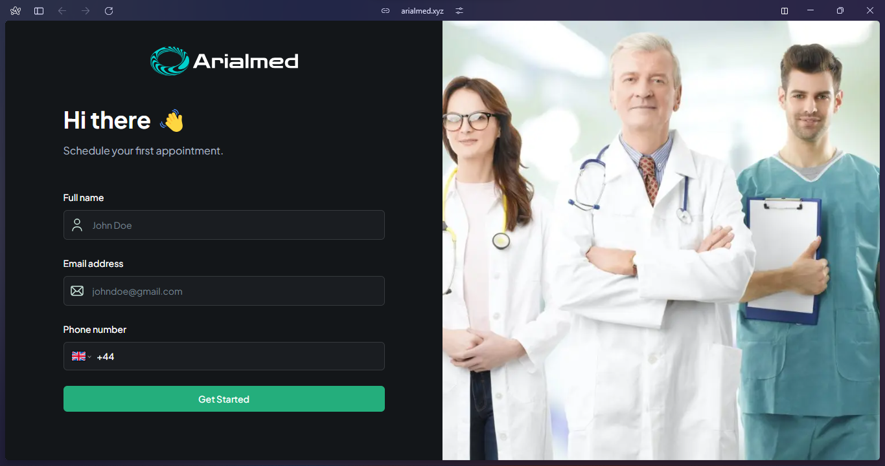
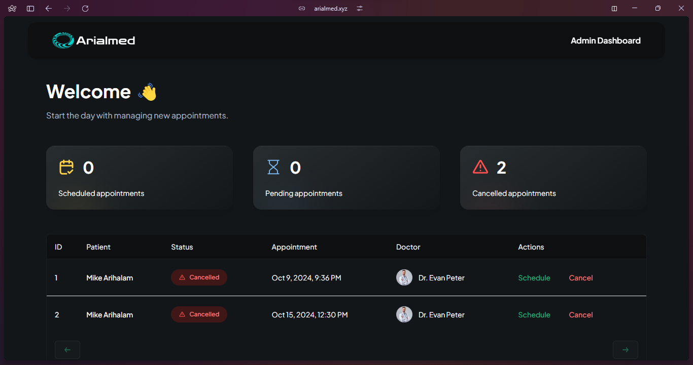
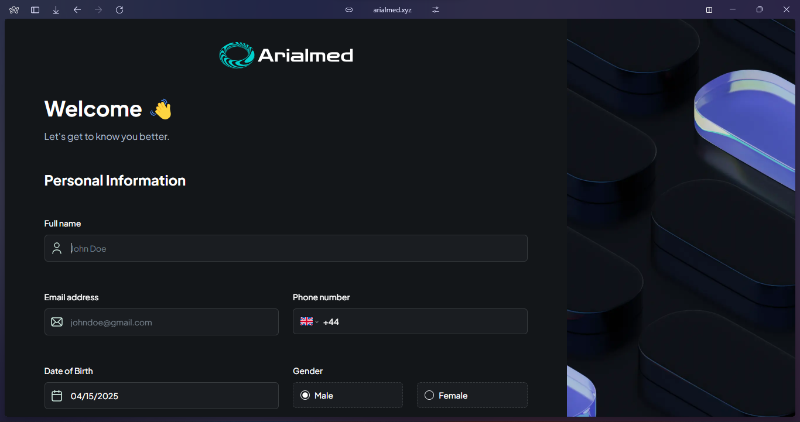
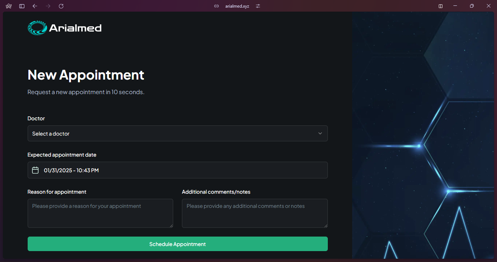

# Arialmed - Healthcare Management System

[](https://arialmed.xyz)

A multi-tier web application, secure healthcare management platform built with Next.js and Azure cloud infrastructure. The system provides comprehensive appointment management capabilities for both medical staff and patients. You can view the live demo [here](https://arialmed.xyz), and to access the admin dashboard, use the following passkey: 123456. The passkey will be changed in a week for security reasons.

## Application Screenshots

### Landing Page

*A modern and welcoming interface for scheduling your first appointment with our medical professionals*

### Admin Dashboard

*Comprehensive dashboard for medical staff to manage appointments, track patient schedules, and monitor cancellations*

### Patient Pages
#### Patient Information Form

*Secure and user-friendly form for collecting patient details*

#### Appointment Scheduling

*Intuitive interface for patients to schedule appointments with their preferred doctors*

## Features

### Patient Portal
- Secure appointment scheduling and management
- Document upload with validation
- Real-time notifications

### Admin Dashboard
- Comprehensive appointment management
- Patient record access
- Real-time analytics and reporting
- Role-based access control
- Audit logging

## Tech Stack

### Frontend
- Next.js 14 with TypeScript
- Tailwind CSS for styling
- React components and hooks
- Responsive design principles

### Backend & Database
- Appwrite Backend-as-a-Service
- Node.js runtime
- Zod for data validation
- Secure data storage

### Infrastructure
- Azure Cloud Services
- Terraform for Infrastructure as Code
- Docker containerization
- Azure DevOps for CI/CD

### Security
- Network Security Groups (NSG)
- Azure Key Vault integration
- SonarQube code analysis
- Sentry error tracking

### What I have learned 
- Cloud Infrastructure Automation
- CI/CD Best Practices
- Docker Containerization
- Scalable System Design

## Getting Started

### Prerequisites
- Node.js 18 or higher
- Docker Desktop
- Azure CLI
- Git

### Installation

1. Clone the repository:
```bash
git clone https://github.com/Miguelarial/arialmed-healthcare-app.git
cd arialmed-healthcare-app
```

2. Install dependencies:
```bash
npm install
```

3. Create a `.env.local` file in the root directory. Copy the template below and replace the placeholder values with your actual credentials:
```bash
# Project Configuration
PROJECT_ID=your_appwrite_project_id
API_KEY=your_appwrite_api_key
DATABASE_ID=your_database_id
PATIENT_COLLECTION_ID=appwrite_patients
DOCTOR_COLLECTION_ID=appwrite_doctors
APPOINTMENT_COLLECTION_ID=appwrite_appointments

NEXT_PUBLIC_BUCKET_ID=appwrite_bucket_id
NEXT_PUBLIC_ENDPOINT=https://your-appwrite-endpoint/v1
NEXT_PUBLIC_SERVICEID=emailjs_service_id
NEXT_PUBLIC_TEMPLATEID=emailjs_template_id
NEXT_PUBLIC_APIKEY=emailjs_public_key

# Security
NEXT_PUBLIC_ADMIN_PASSKEY=your_secure_passkey
```

4. Run the development server:
```bash
npm run dev

```

### Docker Deployment

1. Build the Docker image:
```bash
docker build -t arialmed .
```

2. Run the container:
```bash
docker-compose up -d
```

## Infrastructure Setup

### Azure Resources
1. Initialize Terraform:
```bash
cd terraform
terraform init
```

2. Review and apply infrastructure changes:
```bash
terraform plan
terraform apply
```

